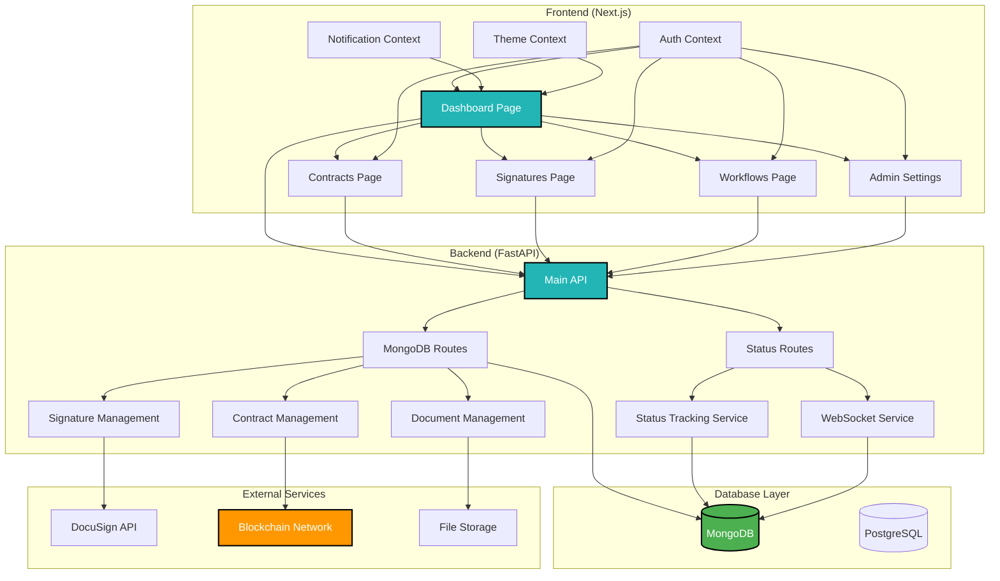
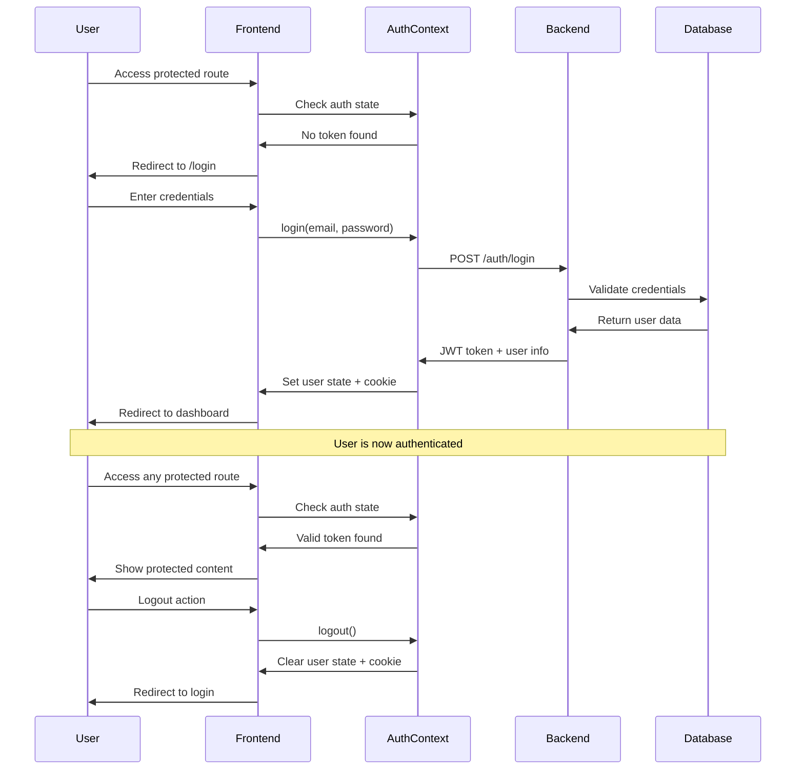
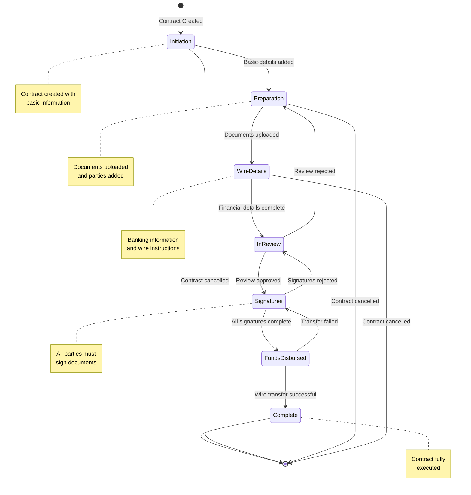
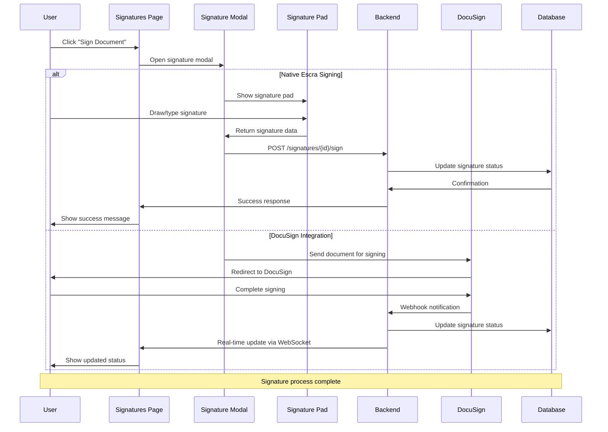
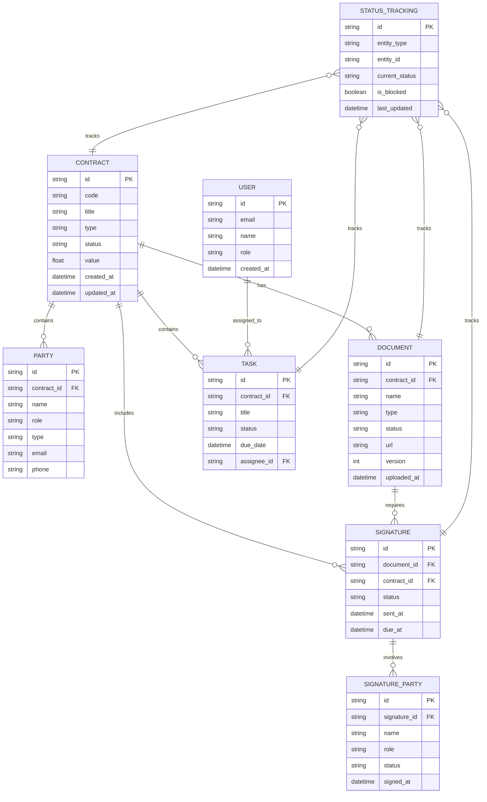
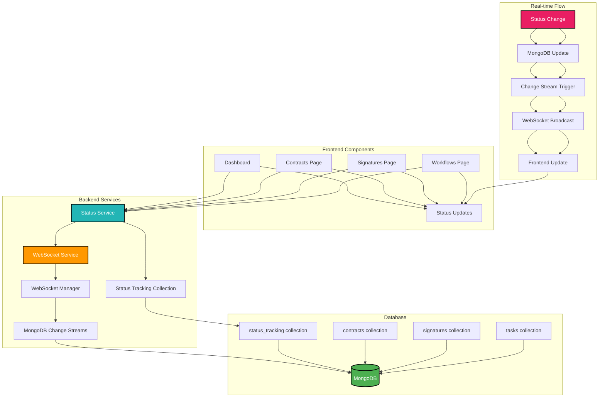

# Escra System Architecture Diagrams

## 1. High-Level System Architecture



## 2. Authentication and User Flow



## 3. Contract Lifecycle Workflow



## 4. Document Signing Process



## 5. Database Schema and Data Relationships



## 6. Real-time Status Tracking System



## 7. API Endpoints and Data Flow

```mermaid
graph LR
    subgraph "Frontend API Calls"
        A[Contracts API] --> B[GET /api/contracts]
        A --> C[POST /api/contracts]
        A --> D[PUT /api/contracts/{id}]
        A --> E[DELETE /api/contracts/{id}]
        
        F[Signatures API] --> G[GET /api/signatures]
        F --> H[POST /api/signatures]
        F --> I[PUT /api/signatures/{id}]
        
        J[Documents API] --> K[GET /api/documents]
        J --> L[POST /api/documents]
        J --> M[PUT /api/documents/{id}]
    end
    
    subgraph "Backend Routes"
        N[mongo_routes.py] --> O[Contract Management]
        N --> P[Document Management]
        N --> Q[Signature Management]
        N --> R[User Management]
        
        S[status.py] --> T[Status Updates]
        S --> U[WebSocket Endpoints]
    end
    
    subgraph "Data Processing"
        V[Status Service] --> W[Dependency Checking]
        V --> X[Status Transitions]
        V --> Y[Real-time Updates]
        
        Z[WebSocket Service] --> AA[Connection Management]
        Z --> BB[Broadcasting]
    end
    
    B --> O
    C --> O
    D --> O
    E --> O
    
    G --> Q
    H --> Q
    I --> Q
    
    K --> P
    L --> P
    M --> P
    
    O --> V
    P --> V
    Q --> V
    
    T --> V
    U --> Z
    
    style N fill:#23B5B5,stroke:#000,stroke-width:2px,color:#fff
    style S fill:#FF9800,stroke:#000,stroke-width:2px,color:#fff
    style V fill:#9C27B0,stroke:#000,stroke-width:2px,color:#fff
```

## 8. Component Architecture

```mermaid
graph TB
    subgraph "Pages"
        A[Dashboard Page] --> B[Contracts List]
        A --> C[Metrics Cards]
        A --> D[Activity Timeline]
        
        E[Contracts Page] --> F[Contracts Table]
        E --> G[New Contract Modal]
        E --> H[Contract Details]
        
        I[Signatures Page] --> J[Signatures Table]
        I --> K[Signature Modal]
        I --> L[Signature Pad]
        
        M[Workflows Page] --> N[Tasks Table]
        M --> O[Task Details]
        M --> P[Status Manager]
    end
    
    subgraph "Common Components"
        Q[Card] --> R[Button]
        Q --> S[Input]
        Q --> T[Select]
        Q --> U[Modal]
        
        V[Layout] --> W[Header]
        V --> X[Sidebar]
        V --> Y[Footer]
    end
    
    subgraph "Context Providers"
        Z[AuthContext] --> AA[User State]
        BB[NotificationContext] --> CC[Toast System]
        DD[ThemeContext] --> EE[Dark Mode]
    end
    
    subgraph "Data Stores"
        FF[Contract Store] --> GG[Contract State]
        HH[Document Store] --> II[Document State]
        JJ[Assignee Store] --> KK[Assignee State]
        LL[Task Store] --> MM[Task State]
    end
    
    A --> Q
    E --> Q
    I --> Q
    M --> Q
    
    A --> Z
    E --> Z
    I --> Z
    M --> Z
    
    A --> BB
    E --> BB
    I --> BB
    M --> BB
    
    E --> FF
    I --> HH
    M --> LL
    
    style A fill:#23B5B5,stroke:#000,stroke-width:2px,color:#fff
    style Q fill:#4CAF50,stroke:#000,stroke-width:2px,color:#fff
    style Z fill:#FF9800,stroke:#000,stroke-width:2px,color:#fff
    style FF fill:#9C27B0,stroke:#000,stroke-width:2px,color:#fff
```



## Key Architectural Patterns

### 1. **Frontend Architecture**
- **Next.js App Router**: File-based routing with layout nesting
- **Context API**: Global state management for auth, notifications, and theme
- **Component Composition**: Reusable UI components with consistent styling
- **Custom Hooks**: Business logic abstraction and state management

### 2. **Backend Architecture**
- **FastAPI**: Modern Python web framework with automatic API documentation
- **MongoDB**: Document-based database for flexible data modeling
- **WebSocket Integration**: Real-time status updates and notifications
- **Service Layer Pattern**: Business logic separation from API routes

### 3. **Data Flow Patterns**
- **Optimistic Updates**: Frontend updates immediately, syncs with backend
- **Real-time Synchronization**: WebSocket-based status tracking
- **Event-Driven Architecture**: Status changes trigger dependent updates
- **Dependency Management**: Cross-entity status dependencies

### 4. **Security & Authentication**
- **JWT-based Authentication**: Stateless token authentication
- **Role-based Access Control**: Admin, Editor, Signer, Viewer roles
- **Protected Routes**: Middleware-based route protection
- **CORS Configuration**: Secure cross-origin requests

### 5. **Integration Points**
- **DocuSign API**: External signature service integration
- **Blockchain Network**: Smart contract execution (planned)
- **File Storage**: Document upload and management
- **Webhook Support**: External service notifications

This architecture provides a scalable, maintainable, and secure foundation for the Escra smart contract platform, with clear separation of concerns and modern development practices.
